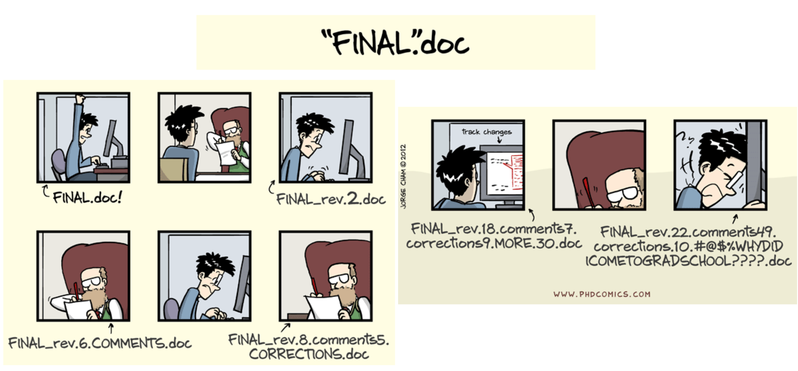
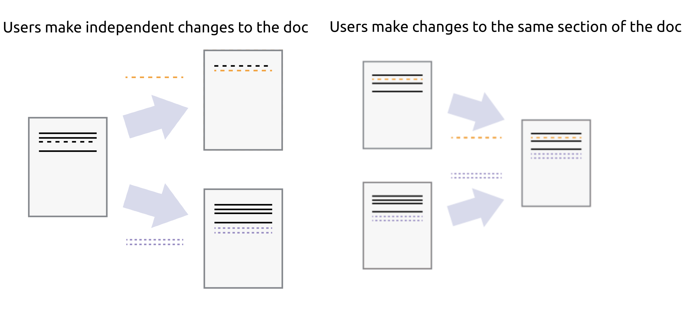

# Introduction to git and github
Miguel Xochicale

# 

Introduction
to `git` and GitHub  
  
    
 Miguel Xochicale, PhD  
Zakaria Senousy,
PhD  
[
`mxochicale/`](https://github.com/mxochicale/)`{`[`intro-to-git-and-github`](https://github.com/mxochicale/intro-to-git-and-github)`}`

2024-04-20 @
[Link for grid-worms-animation
2023](https://github.com/saforem2/grid-worms-animation/)

# Overview

1.  [Automated Version Control](#sec-avc)
    - [What is it? Why shoud I care?](#sec-avc-care)
2.  [Git and GitHub](#sec-gg)
    - [commands: init, clone, status, pull, etc](#sec-su3)
    - [Other useful commands: branch, diff, log, rebase,
      switch](#sec-other-c)
    - [Workflow:issues, branches, PRs](#sec-su3)
3.  [References](#sec-references)
4.  [Exercises](#sec-extras)

## Automated Version Control (AVC)

::: {#sec-avc} 

## Automated Version Control (AVC)

- A system that automatically manages changes to files, typically in the
  context of software development.
- Keeps track of every modification to the code in a special kind of
  database.
- If a mistake is made, developers can turn back the clock and compare
  earlier versions of the code to help fix the mistake while minimising
  disruption to all team members.

## AVC: What should I care?

::: {#sec-avc-care}

## AVC: What should I care?

## Automated Version Control

- **Backup and restore**: Changes are stored securely and can be
  restored at any point.
- **Collaboration**: Multiple people can work on the same project at the
  same time.
- **Track changes**: You can see who last modified something that might
  be causing a problem, who introduced an issue, when it was introduced,
  and more.
- **Explore alternatives**: Safely experiment with new ideas in a
  branch, without affecting the main project.

## Introduction to Git and GitHub

::: {#sec-gg} - **Git**: A version control system that lets you manage
and keep track of your source code history. - **GitHub**: A cloud-based
hosting service that lets you manage Git repositories. - **Benefits**: -
Track changes in your code across versions. - Collaborate with others on
projects. - Backup your work on the cloud.

## Git command Basics

### Setting up

- **Installation**:
  - Download from [git-scm.com](https://git-scm.com/)
- **Configuration**:
  - Set your user name: `git config --global user.name "Your Name"`
  - Set your email:
    `git config --global user.email "your.email@example.com"`

------------------------------------------------------------------------

### Creating repo

- **Initialise a New Repo**:
  - `git init`
- **Cloning an Existing Repo**:
  - `git clone https://github.com/username/repository.git`

------------------------------------------------------------------------

## Git command Basics

### Making Changes and Committing

- **Track Changes**:
  - `git status`
  - `git add <file>`
- **Commit Changes**:
  - `git commit -m "Commit message"`

------------------------------------------------------------------------

### Pulling Updates

- **Using Git Pull**:
  - `git pull origin master`
  - This command pulls changes from the remote repository and merges
    them into your local branch.

------------------------------------------------------------------------

### Pushing Changes

- **Connect to Remote Repo**:
  - `git remote add origin https://github.com/username/repository.git`
- **Push Changes**:
  - `git push origin master`

------------------------------------------------------------------------

## Other Useful Git Commands

### Branch Management

- `git branch`: List, create, or delete branches.
- `git switch <branch>`: Switch branches.

------------------------------------------------------------------------

### Investigating Changes

- `git log`: Display commit logs.
- `git diff`: Show file differences not yet staged.

------------------------------------------------------------------------

### Reorganising Commits

- `git rebase`: Reapply commits on top of another base tip.

------------------------------------------------------------------------

## Status of Large Language Models[^1]

## GitHub workflow

## Hello :robot:

This presentation will show you examples of what you can do with Quarto
and [Reveal.js](https://revealjs.com), including:

- Presenting code and LaTeX equations
- Including computations in slide output
- Image, video, and iframe backgrounds
- Fancy transitions and animations
- Printing to PDF

…and much more

## References

- [Version Control with
  Git](https://github-pages.ucl.ac.uk/git-novice/01-basics.html)
- [Version Control with
  Mercurial](https://swcarpentry.github.io/hg-novice/)
- [Introduction to Version
  Control](https://github.com/UCL/rsd-engineeringcourse/tree/main/ch00git)
- [Resolving a merge conflict using the command
  line](https://docs.github.com/en/pull-requests/collaborating-with-pull-requests/addressing-merge-conflicts/resolving-a-merge-conflict-using-the-command-line)

[^1]: [
    `saforem2/llm-lunch-talk`](https://github.com/Hannibal046/Awesome-LLM)
    [(slides)](https://saforem2.github.io/llm-lunch-talk)
